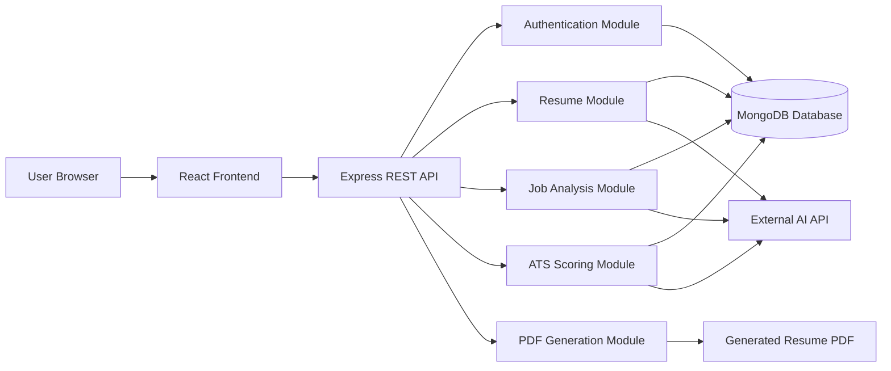
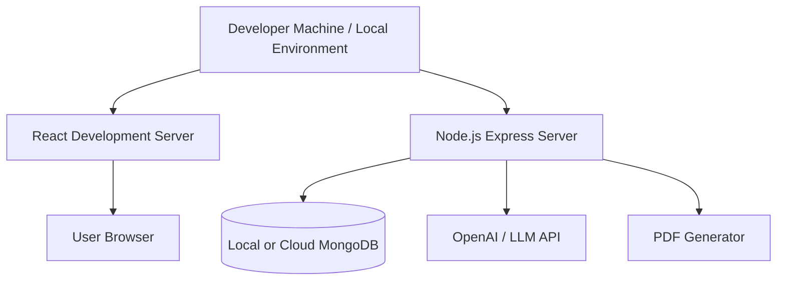
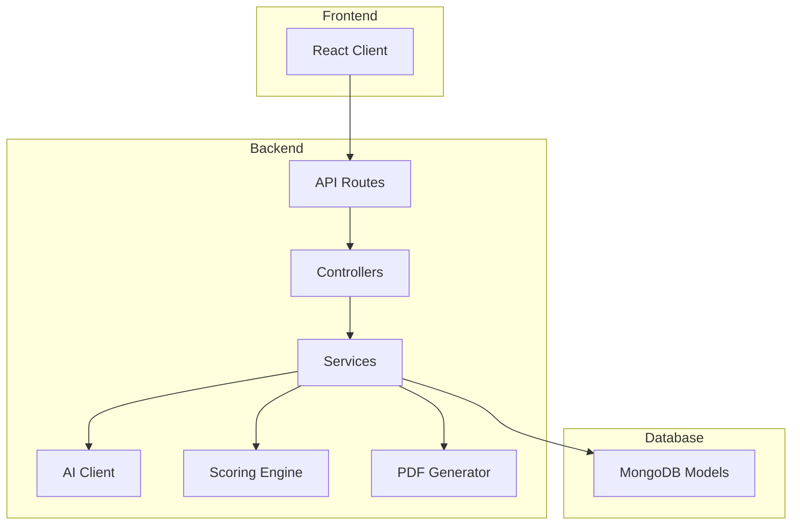
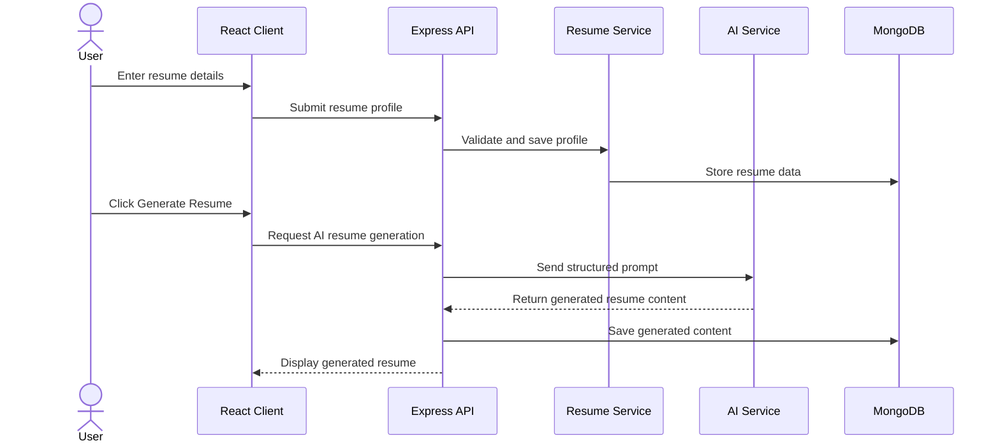
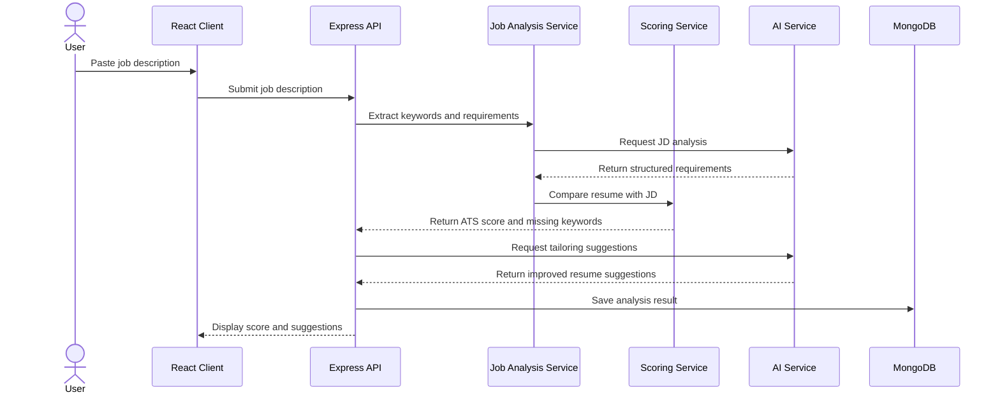
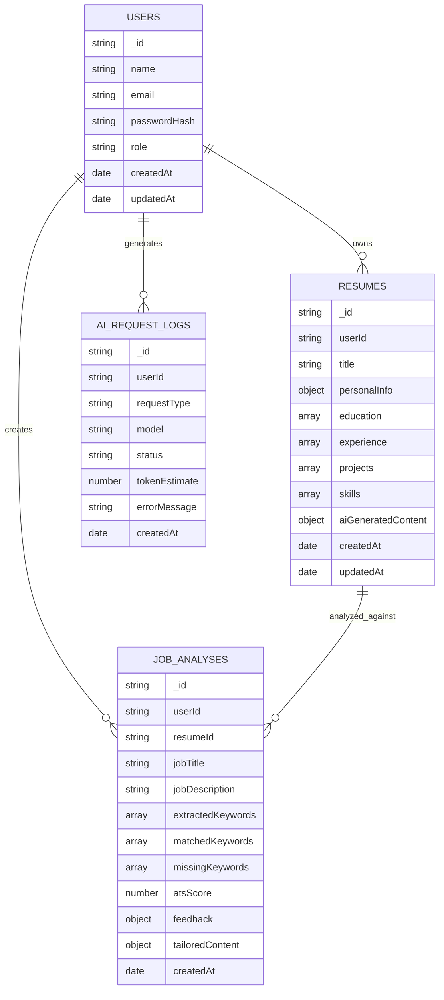

# Summary

This Software Design Document (SDD) presents the architectural and detailed design of the proposed Final Year Project titled **AI-Powered Resume Builder & Job Matching System**. The system is designed as a responsive web application that assists students, fresh graduates, and job seekers in creating professional resumes, analyzing job descriptions, calculating ATS-style resume matching scores, and generating job-specific tailoring suggestions.

The design follows a modular client-server architecture consisting of a React-based frontend, Node.js and Express.js backend, MongoDB database, AI integration layer, scoring service, and PDF generation service. The solution uses a hybrid design approach: Artificial Intelligence is used for resume content generation, job description analysis, and natural language feedback, while deterministic rule-based logic is used for validation, keyword matching, completeness checks, scoring support, and system control.

This document describes the high-level architecture, component design, database design, interface design, algorithms, AI prompt strategy, security design, error handling, and quality considerations required to implement the project in a professional and maintainable manner.

---

# Table of Contents

1. [Introduction](#1-introduction)  
   1.1. [Purpose](#11-purpose)  
   1.2. [Scope](#12-scope)  
   1.3. [Intended Audience](#13-intended-audience)  
   1.4. [Design Goals](#14-design-goals)  
   1.5. [Definitions, Acronyms, and Abbreviations](#15-definitions-acronyms-and-abbreviations)  
2. [System Overview](#2-system-overview)  
   2.1. [Product Perspective](#21-product-perspective)  
   2.2. [Users and Actors](#22-users-and-actors)  
   2.3. [Assumptions and Design Constraints](#23-assumptions-and-design-constraints)  
3. [Architectural Design](#3-architectural-design)  
   3.1. [Architecture Style](#31-architecture-style)  
   3.2. [High-Level Architecture](#32-high-level-architecture)  
   3.3. [Deployment Design](#33-deployment-design)  
   3.4. [Component Responsibilities](#34-component-responsibilities)  
4. [Detailed System Design](#4-detailed-system-design)  
   4.1. [Frontend Design](#41-frontend-design)  
   4.2. [Backend Design](#42-backend-design)  
   4.3. [AI Resume Generation Flow](#43-ai-resume-generation-flow)  
   4.4. [Job Tailoring and ATS Scoring Flow](#44-job-tailoring-and-ats-scoring-flow)  
5. [Data Design](#5-data-design)  
   5.1. [Collections and Key Fields](#51-collections-and-key-fields)  
   5.2. [Data Validation and Indexing](#52-data-validation-and-indexing)  
6. [Interface Design](#6-interface-design)  
   6.1. [API Design](#61-api-design)  
   6.2. [Request and Response Format](#62-request-and-response-format)  
7. [Algorithm and AI Design](#7-algorithm-and-ai-design)  
   7.1. [AI Prompt Design Strategy](#71-ai-prompt-design-strategy)  
   7.2. [ATS-Style Scoring Design](#72-ats-style-scoring-design)  
   7.3. [Keyword Matching Process](#73-keyword-matching-process)  
8. [Security and Privacy Design](#8-security-and-privacy-design)  
9. [Error Handling and Logging Design](#9-error-handling-and-logging-design)  
10. [Testing and Quality Considerations](#10-testing-and-quality-considerations)  
11. [Requirement-to-Design Traceability](#11-requirement-to-design-traceability)  
12. [References](#12-references)

---

# 1. Introduction

The **AI-Powered Resume Builder & Job Matching System** is a web-based career support application designed to help users create professional resumes and improve them according to specific job descriptions. The system focuses on solving common resume-related problems faced by students and early-career job seekers, such as weak resume wording, missing job-related keywords, lack of ATS awareness, and difficulty tailoring resumes for different roles.

This Software Design Document defines how the system will be structured internally and how its major modules will interact. It translates the functional and non-functional requirements of the SRS into a technical design that can be implemented by the development team.

---

## 1.1 Purpose

The purpose of this document is to describe the software design of the proposed system in a clear and formal manner. It explains the architecture, components, database collections, interfaces, data flow, algorithms, AI integration approach, security mechanisms, and deployment considerations of the project.

---

## 1.2 Scope

The scope of this design covers the FYP version of the system. The project will be implemented as a responsive web application. It will include user authentication, resume profile management, AI resume generation, job description analysis, ATS-style score calculation, resume tailoring suggestions, resume preview, and PDF export.

The following points are outside the scope of the FYP version:

- The system will not include a separate Android or iOS mobile application.
- The system will not directly apply to jobs on behalf of the user.
- The system will not include payment or subscription modules.
- The system will not provide professional legal or guaranteed recruitment advice.
- The system will use external AI services only for controlled text generation and analysis tasks.

---

## 1.3 Intended Audience

This document is intended for:

- Project supervisor and academic evaluators
- Student development team responsible for implementation
- Future maintainers who may extend the system
- Technical reviewers who need to understand system design decisions

---

## 1.4 Design Goals

The major design goals of the system are:

- Provide a modular and maintainable architecture.
- Separate frontend, backend, database, AI, scoring, and PDF responsibilities.
- Use AI only where it provides clear value, while keeping validation and scoring logic controlled.
- Protect user resume data through authentication, authorization, and careful data handling.
- Allow future extensions such as cover letter generation, additional templates, and job portal integration.

---

## 1.5 Definitions, Acronyms, and Abbreviations

| Term | Meaning |
|---|---|
| AI | Artificial Intelligence |
| ATS | Applicant Tracking System used by organizations to filter job applications |
| JD | Job Description |
| LLM | Large Language Model used for text generation and analysis |
| NLP | Natural Language Processing |
| REST API | Representational State Transfer application programming interface |
| SRS | Software Requirement Specification |
| SDD | Software Design Document |
| JWT | JSON Web Token used for authentication |

---

# 2. System Overview

The proposed system is an independent web application that provides an end-to-end workflow for resume creation and job-specific optimization. A user enters resume data through structured forms. The backend validates and stores the data, then uses AI services to generate professional resume sections. The user can paste a job description, after which the system analyzes the role requirements, compares them with the resume, generates a matching score, and suggests improvements.

---

## 2.1 Product Perspective

The product is designed as a standalone system and is not dependent on an existing institutional platform. It can operate locally for FYP demonstration or be deployed as a web application in the future. The design follows a layered architecture to simplify development and maintenance.

---

## 2.2 Users and Actors

| Actor | Description | Responsibilities |
|---|---|---|
| Guest User | A visitor who has not logged in. | Can view landing page and access sign up or login screens. |
| Registered User | A student, fresh graduate, or job seeker. | Creates resume profile, generates resume, analyzes job description, views score, exports PDF. |
| AI Service | External language model service. | Generates resume content, extracts job keywords, and produces improvement suggestions. |
| PDF Service | Internal backend component. | Converts finalized resume content into a downloadable PDF file. |
| System Administrator | Optional administrative actor for future extension. | May manage system settings, users, and AI usage limits. |

---

## 2.3 Assumptions and Design Constraints

- Users will provide truthful resume information; AI output should not invent false achievements.
- The FYP version may run locally or in a controlled environment without full public deployment.
- AI API usage will be controlled through prompt size limits, validation, and optional demo fallback responses.
- The application will be mobile responsive, but the primary experience will be optimized for desktop and laptop usage.
- Resume PDF output will follow a simple ATS-friendly layout instead of highly graphical templates.

---

# 3. Architectural Design

## 3.1 Architecture Style

The system will use a layered client-server architecture. The frontend layer handles user interaction and presentation. The backend layer exposes REST APIs and coordinates business logic. The database layer stores persistent data. The AI service layer communicates with an external LLM API through controlled service methods. The PDF generation layer converts structured resume data into a downloadable document.

| Layer | Responsibility |
|---|---|
| Presentation Layer | Provides responsive user interface, forms, preview screens, and dashboards. |
| API Layer | Receives client requests, validates inputs, and routes requests to services. |
| Service Layer | Implements business logic such as AI prompts, scoring, keyword matching, and PDF generation. |
| Data Access Layer | Uses MongoDB models to store and retrieve user, resume, and job analysis data. |
| External Service Layer | Communicates with AI API for resume generation and analysis. |

---

## 3.2 High-Level Architecture

The following diagram shows the main components and external dependencies of the system.



**Figure 1: High-Level System Architecture**

---

## 3.3 Deployment Design

For FYP demonstration, the frontend and backend can run locally. The backend will connect to MongoDB and to the AI API through environment variables. The same design can be deployed later using a frontend hosting provider, backend server, and managed MongoDB instance.



**Figure 2: Deployment Design**

---

## 3.4 Component Responsibilities



**Figure 3: Component-Level Architecture**

| Component | Main Responsibility |
|---|---|
| React Client | Collects user input, displays resume preview, shows job analysis results, and downloads PDF. |
| Auth Controller | Handles registration, login, token verification, and secure access. |
| Resume Controller | Handles resume profile CRUD operations and preview updates. |
| AI Service | Builds prompts, calls the AI API, validates response structure, and returns generated text. |
| Scoring Service | Calculates ATS-style score using keywords, completeness, and weighted matching rules. |
| Job Analysis Service | Extracts requirements from job descriptions and prepares comparison data. |
| PDF Service | Generates a clean, ATS-friendly PDF from finalized resume data. |
| MongoDB Models | Represent users, resumes, job analyses, and AI request logs. |

---

# 4. Detailed System Design

This section describes the internal design of each major module. Each module is designed to be independently testable and maintainable.

| Module | Responsibilities | Important Design Elements |
|---|---|---|
| Authentication Module | Register users, authenticate credentials, issue JWT tokens, protect APIs. | User model, JWT utility, password hashing service. |
| Resume Profile Module | Create, update, retrieve, and delete structured resume information. | Resume model, validation middleware, resume controller. |
| AI Resume Generation Module | Generate summaries, bullet points, and role-focused resume content. | Prompt builder, AI client, response parser, AI logs. |
| Job Description Analysis Module | Extract skills, responsibilities, qualifications, and role keywords from JD. | JD parser, AI extraction prompt, keyword normalizer. |
| ATS Scoring Module | Calculate score using matched keywords, missing keywords, section completeness, and AI feedback. | Scoring rules, weights, match calculator. |
| Resume Tailoring Module | Generate tailored suggestions without inventing false information. | Tailoring prompt, safety constraints, suggestion applier. |
| PDF Export Module | Create and stream/download formatted resume PDF. | PDF generator, template builder, file response. |
| Dashboard Module | Show resume list, recent analyses, scores, and quick actions. | Frontend cards, charts, summaries. |

---

## 4.1 Frontend Design

The frontend will be implemented in React.js with TypeScript. It will use reusable components for forms, section editors, resume preview, job description input, feedback cards, and action buttons. The design will be responsive so that users can access the system from desktop and mobile browsers.

| Screen | Purpose | Main Elements |
|---|---|---|
| Landing Page | Introduce the system and provide login/sign up navigation. | Hero section, feature summary, call-to-action buttons. |
| Authentication Screens | Allow users to register and log in. | Email, password, validation messages. |
| Dashboard | Show user resumes and recent job analyses. | Resume cards, create resume button, analysis history. |
| Resume Builder | Collect structured resume information. | Personal info, education, skills, projects, experience forms. |
| AI Resume Preview | Display generated content and allow editing. | Live resume preview, edit controls, regenerate button. |
| Job Matching Screen | Analyze JD and compare with resume. | Job description text area, score, matched and missing keywords. |
| PDF Preview / Export | Allow final review and PDF download. | Resume preview, export button. |

---

## 4.2 Backend Design

The backend will be implemented using Node.js and Express.js. It will follow a route-controller-service-model pattern. Routes receive HTTP requests, controllers validate and coordinate workflows, services contain business logic, and models interact with MongoDB.

| Backend Folder | Purpose |
|---|---|
| `routes/` | Defines REST API endpoints for authentication, resumes, job analysis, AI operations, and PDF export. |
| `controllers/` | Handles request validation, response formatting, and workflow coordination. |
| `services/` | Contains AI service, scoring logic, PDF generation logic, authentication utilities, and keyword matching. |
| `models/` | Defines MongoDB schemas for users, resumes, analyses, and logs. |
| `middlewares/` | Contains authentication middleware, error handler, and validation middleware. |
| `utils/` | Contains helper functions such as text cleanup, keyword normalization, and response helpers. |

---

## 4.3 AI Resume Generation Flow



**Figure 4: Sequence Diagram for AI Resume Generation**

---

## 4.4 Job Tailoring and ATS Scoring Flow



**Figure 5: Sequence Diagram for Job Tailoring and ATS Scoring**

---

# 5. Data Design

MongoDB will be used as the primary database because the resume structure contains nested and flexible information such as education, experience, projects, skills, and AI-generated sections. The database design uses separate collections for users, resumes, job analysis results, and AI request logs.



**Figure 6: Database Design / Entity Relationship View**

---

## 5.1 Collections and Key Fields

| Collection | Key Fields | Description |
|---|---|---|
| `users` | `_id`, `name`, `email`, `passwordHash`, `role`, `createdAt`, `updatedAt` | Stores authentication and profile identity data. |
| `resumes` | `_id`, `userId`, `title`, `personalInfo`, `education[]`, `experience[]`, `projects[]`, `skills[]`, `aiGeneratedContent`, `createdAt`, `updatedAt` | Stores structured resume data and generated resume sections. |
| `jobAnalyses` | `_id`, `userId`, `resumeId`, `jobTitle`, `jobDescription`, `extractedKeywords[]`, `matchedKeywords[]`, `missingKeywords[]`, `atsScore`, `feedback`, `tailoredContent`, `createdAt` | Stores job description analysis, scoring, and tailoring output. |
| `aiRequestLogs` | `_id`, `userId`, `requestType`, `model`, `status`, `tokenEstimate`, `errorMessage`, `createdAt` | Stores AI request status and debugging information. |

---

## 5.2 Data Validation and Indexing

- Email field in the `users` collection will be unique and indexed.
- Resume records will include a `userId` reference to enforce ownership.
- Job analysis records will reference both `userId` and `resumeId`.
- Required resume fields will be validated before AI generation.
- Large text inputs such as job descriptions will have length limits to control AI cost and response time.
- AI output will be parsed and checked before it is saved.

---

# 6. Interface Design

The system will expose REST APIs consumed by the React frontend. All private APIs will require authentication through a bearer token. API responses will follow a consistent JSON format containing success status, data, and error information if applicable.

---

## 6.1 API Design

| Method | Endpoint | Purpose | Access |
|---|---|---|---|
| POST | `/api/auth/register` | Create a new user account. | Public |
| POST | `/api/auth/login` | Authenticate user and return token. | Public |
| GET | `/api/resumes` | Get all resumes of logged-in user. | Private |
| POST | `/api/resumes` | Create a new resume profile. | Private |
| PUT | `/api/resumes/:id` | Update resume profile. | Private |
| DELETE | `/api/resumes/:id` | Delete a resume profile. | Private |
| POST | `/api/ai/generate-resume` | Generate AI resume content from resume data. | Private |
| POST | `/api/jobs/analyze` | Analyze job description and extract requirements. | Private |
| POST | `/api/jobs/match` | Calculate score and generate feedback. | Private |
| POST | `/api/jobs/tailor` | Generate job-specific resume tailoring suggestions. | Private |
| GET | `/api/pdf/resume/:id` | Export selected resume as PDF. | Private |

---

## 6.2 Request and Response Format

All API responses will use a consistent JSON structure similar to the following:

```json
{
  "success": true,
  "message": "Operation completed successfully",
  "data": {}
}
```

Error responses will include a meaningful error message and may include field-level validation details.

```json
{
  "success": false,
  "message": "Validation failed",
  "errors": [
    "Email is required",
    "Password must be at least 8 characters"
  ]
}
```

---

# 7. Algorithm and AI Design

## 7.1 AI Prompt Design Strategy

AI prompts will be designed to produce structured, controlled, and relevant output. The backend will not send raw user input directly without context. Instead, it will build a structured prompt that specifies the required output format, tone, section names, and limitations. The AI will be instructed not to invent experience, education, projects, or achievements that the user has not provided.

The AI prompt strategy will follow these principles:

- Prompts will include only necessary resume and job description data.
- AI output will be requested in structured JSON or clearly separated sections.
- The system will validate AI response before displaying or saving it.
- AI-generated suggestions will be treated as editable suggestions rather than final facts.
- The user will be able to edit all generated content before PDF export.

---

## 7.2 ATS-Style Scoring Design

The ATS-style score will be calculated using a hybrid method. The score will not claim to represent an actual company ATS result; instead, it will provide an estimated compatibility score based on resume completeness and job description matching.

| Scoring Factor | Weight | Description |
|---|---:|---|
| Keyword Match | 40% | Compares resume skills and terms with extracted job keywords. |
| Section Completeness | 25% | Checks availability of summary, skills, education, projects, and experience where applicable. |
| Role Relevance | 20% | Evaluates whether resume content aligns with job role and responsibilities. |
| Formatting Readiness | 15% | Checks simple, ATS-friendly structure and avoids overly complex formatting. |

---

## 7.3 Keyword Matching Process

1. Normalize job description text by converting to lowercase and removing unnecessary punctuation.
2. Extract important skills, tools, technologies, responsibilities, and qualifications.
3. Normalize resume skills and content in the same way.
4. Compare job keywords with resume keywords.
5. Classify keywords into matched and missing categories.
6. Calculate score contribution using defined weights.
7. Pass missing keyword information to AI service for improvement suggestions.

---

# 8. Security and Privacy Design

The system will handle personal user information, resume data, education details, contact information, and job application-related content. Therefore, security and privacy must be considered during design and implementation.

| Area | Design Decision |
|---|---|
| Authentication | Users will log in using email and password. The backend will issue JWT tokens after successful login. |
| Password Storage | Passwords will be hashed using a secure hashing method before being stored. |
| Authorization | Users will only access resumes and analyses that belong to their own account. |
| Input Validation | All user input will be validated on both frontend and backend. |
| AI Data Handling | Only the required resume/JD data will be sent to the AI service. Sensitive unnecessary data will be avoided. |
| Environment Secrets | API keys, database URI, and JWT secrets will be stored in environment variables. |
| Error Messages | Errors shown to users will be meaningful but will not expose internal server details. |

---

# 9. Error Handling and Logging Design

The system will use centralized error handling on the backend. Expected errors such as validation failures, invalid credentials, missing records, and AI service failures will be handled gracefully. Unexpected errors will be logged for debugging and a generic error response will be returned to the user.

| Error Type | Handling Strategy |
|---|---|
| Validation Error | Return 400 response with field-specific messages. |
| Authentication Error | Return 401 response and ask user to log in again. |
| Authorization Error | Return 403 response if user attempts to access another user's data. |
| Not Found Error | Return 404 response for missing resume or analysis records. |
| AI API Failure | Show retry message and optionally use saved demo fallback for FYP demonstration. |
| PDF Generation Error | Show error message and allow user to retry after checking resume completeness. |
| Database Error | Log error internally and return safe generic message. |

---

# 10. Testing and Quality Considerations

Testing will ensure that the implemented system matches the design and requirements. The project will include unit testing for services, integration testing for APIs, and manual UI testing for user flows. Special focus will be placed on validation, AI response handling, scoring correctness, and PDF output formatting.

| Testing Type | Purpose | Examples |
|---|---|---|
| Unit Testing | Test isolated logic and services. | Keyword matching, scoring calculation, validation helpers. |
| API Testing | Verify backend routes and responses. | Auth APIs, resume CRUD, job analysis endpoint. |
| Integration Testing | Test combined workflows. | Generate resume, analyze JD, calculate score, export PDF. |
| UI Testing | Verify usability and responsiveness. | Forms, preview screen, dashboard, mobile layout. |
| AI Output Review | Check relevance and structure of AI responses. | Ensure AI output does not invent facts and follows requested format. |
| PDF Review | Confirm exported resume layout is clean and readable. | Text alignment, section order, page margins, ATS-friendly style. |

---

# 11. Requirement-to-Design Traceability

| Requirement | Related Design Component |
|---|---|
| FR001 - User Registration | Authentication module, User model, `/api/auth/register` endpoint. |
| FR002 - User Login | Authentication module, JWT service, `/api/auth/login` endpoint. |
| FR003 - Create Resume Profile | Resume profile module, Resume model, Resume Builder screen. |
| FR004 - Generate AI Resume Content | AI resume generation module, prompt builder, AI service integration. |
| FR005 - Edit and Preview Resume | Frontend editor components, resume preview screen, update resume API. |
| FR006 - Analyze Job Description | Job description analysis module, AI extraction prompt, `/api/jobs/analyze`. |
| FR007 - Resume Matching and ATS Score | Scoring service, keyword matching algorithm, ATS dashboard. |
| FR008 - Tailor Resume for Job Description | Resume tailoring module, AI suggestion service, job matching screen. |
| FR009 - Export Resume as PDF | PDF generation service, `/api/pdf/resume/:id` endpoint. |

---

# 12. References

[1] I. Sommerville, *Software Engineering*, 10th ed. Pearson, 2015.

[2] R. S. Pressman and B. R. Maxim, *Software Engineering: A Practitioner's Approach*, 9th ed. McGraw-Hill, 2019.

[3] React, “React Documentation.” Meta Open Source. Available: https://react.dev/

[4] Node.js, “Node.js Documentation.” OpenJS Foundation. Available: https://nodejs.org/en/docs/

[5] MongoDB, “MongoDB Documentation.” Available: https://www.mongodb.com/docs/

[6] OpenAI, “OpenAI API Documentation.” Available: https://platform.openai.com/docs/
