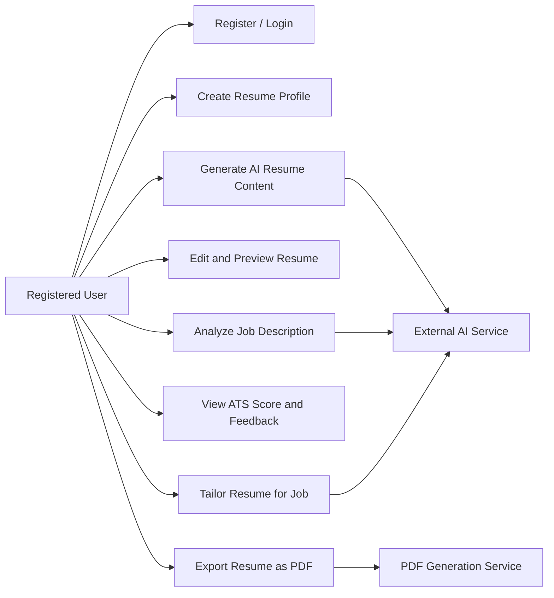
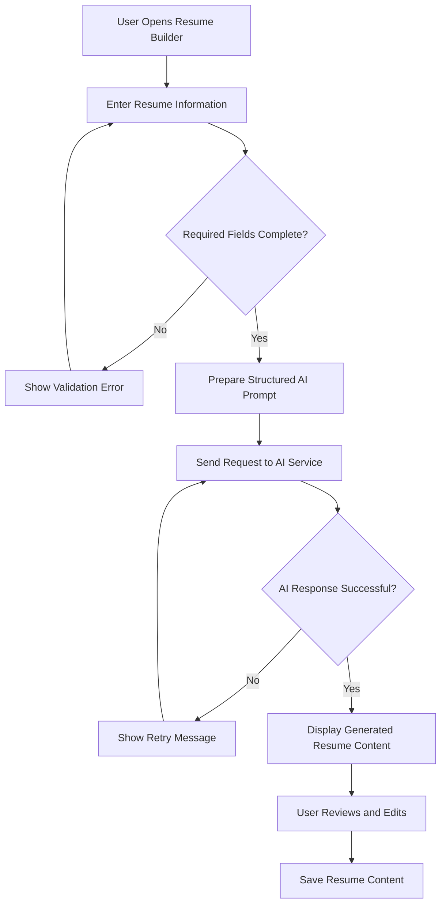
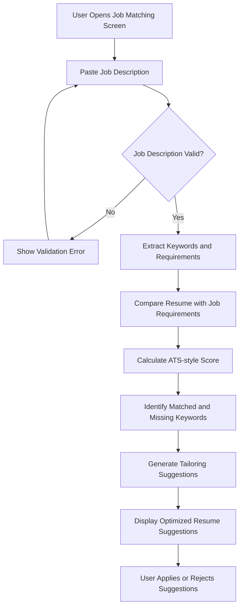

# Software Requirement Specifications

## Summary

This Software Requirement Specification (SRS) document describes the requirements, scope, user roles, functional behavior, non-functional constraints, and use case flows for the proposed Final Year Project titled **AI-Powered Resume Builder & Job Matching System**.

The proposed system is a responsive web-based platform designed to assist students, fresh graduates, and job seekers in creating professional resumes using Artificial Intelligence. The system will allow users to enter their personal, educational, professional, and skill-related information. Based on this information, the AI module will generate professional resume summaries, bullet points, and structured resume content.

The system will also allow users to paste a job description, analyze the job requirements, compare those requirements with the user's resume, calculate an ATS-style match score, and provide suggestions for improvement. The project uses a hybrid approach in which AI-based features are used for resume content generation, job description analysis, and feedback generation, while rule-based mechanisms are used for keyword matching, completeness checks, scoring support, and validation.

---

## Table of Contents

1. [Introduction](#1-introduction)  
   1.1. [Purpose](#11-purpose)  
   1.2. [Scope](#12-scope)  
   1.3. [Product Perspective](#13-product-perspective)  
   1.4. [User Characteristics](#14-user-characteristics)  
   1.5. [Similar Apps and Systems / Literature Review](#15-similar-apps-and-systems--literature-review)  
   1.6. [Proposed Technologies](#16-proposed-technologies)  
2. [Requirements](#2-requirements)  
   2.1. [Functional Requirements](#21-functional-requirements)  
   2.2. [Non-Functional Requirements](#22-non-functional-requirements)  
3. [Use Cases and Flow of Processes](#3-use-cases-and-flow-of-processes)  
   3.1. [User Registration and Login](#31-user-registration-and-login)  
   3.2. [Create Resume Profile](#32-create-resume-profile)  
   3.3. [Generate AI Resume Content](#33-generate-ai-resume-content)  
   3.4. [Analyze Job Description](#34-analyze-job-description)  
   3.5. [Tailor Resume for Job Description](#35-tailor-resume-for-job-description)  
   3.6. [Export Resume as PDF](#36-export-resume-as-pdf)  
4. [References](#4-references)

---

# 1. Introduction

The **AI-Powered Resume Builder & Job Matching System** is a web-based academic software project intended to support users in preparing professional, job-specific, and ATS-compatible resumes. The system targets students, fresh graduates, and early-career job seekers who often face difficulty in presenting their skills, projects, education, and experience in a professional manner.

In many job application processes, resumes are first filtered by automated screening systems or reviewed quickly by recruiters. A resume that is incomplete, poorly structured, or missing important job-related keywords may reduce the candidate's chance of being shortlisted. This project aims to solve that problem by combining Artificial Intelligence, resume generation, job description analysis, ATS-style scoring, and resume tailoring suggestions in a single web application.

The project is not being developed for a specific organization. It is a general-purpose career support system that can be used by students, fresh graduates, and job seekers. The system will focus on resume creation, resume improvement, and job-specific optimization.

---

## 1.1. Purpose

The purpose of this SRS document is to define the software requirements for the **AI-Powered Resume Builder & Job Matching System**. It provides a formal description of the system objectives, scope, users, functional requirements, non-functional requirements, use cases, and process flows.

The main goals of the project are:

- To develop a responsive web application that helps users create professional resumes.
- To use AI for generating resume summaries, experience bullet points, and improvement suggestions from structured user input.
- To analyze job descriptions and identify important skills, technologies, responsibilities, and keywords.
- To compare a user's resume content with a provided job description and generate an ATS-style matching score.
- To provide actionable feedback that helps users improve their resume for a specific job role.
- To allow users to export their final resume in a clean and professional PDF format.

---

## 1.2. Scope

The scope of this project is limited to the development of a web-based AI resume builder and job matching system. The system will include user authentication, resume profile creation, AI-assisted resume content generation, job description analysis, resume-job matching, ATS-style scoring, resume tailoring suggestions, and PDF export.

The system will include the following modules:

- User registration and login module
- Resume information input and management module
- AI resume content generation module
- Job description analysis module
- Resume-job matching and scoring module
- Resume tailoring and feedback module
- PDF export module

The following items are outside the scope of this FYP version:

- A dedicated Android or iOS mobile application
- Direct integration with external job portals
- Payment gateway or subscription billing system
- Real-time recruiter dashboard
- Voice-based resume creation
- Full career counseling chatbot
- Automatic job application submission

---

## 1.3. Product Perspective

The proposed system will be developed as an independent web application. It will not be a module of an already existing system. However, the architecture will be designed in a modular way so that the system can be extended in the future.

The application will consist of:

- A frontend interface for user interaction, forms, preview screens, and analysis dashboards
- A backend API server for business logic, authentication, AI orchestration, and PDF generation
- A database for storing users, resume profiles, job descriptions, and analysis results
- An AI integration layer for resume generation, job description analysis, and feedback generation
- A PDF generation service for exporting final resumes

---

## 1.4. User Characteristics

| User Type | Description | Expected Skill Level |
|---|---|---|
| Student / Fresh Graduate | Creates resume using education, skills, internships, and academic projects. | Basic computer and internet usage |
| Job Seeker | Tailors resume according to a specific job description and downloads optimized resume. | Basic to intermediate web usage |
| System Administrator | Manages system configuration, monitors records, and may review system-level data if admin module is enabled. | Intermediate technical knowledge |

---

## 1.5. Similar Apps and Systems / Literature Review

Existing resume builder systems generally provide templates where users manually enter information and export resumes. Some advanced platforms also provide AI-assisted writing and ATS scanning. However, many tools are either paid, generic, or not designed specifically for academic users and fresh graduates.

| System Category | Common Features | Limitations | Proposed Improvement |
|---|---|---|---|
| Template-based resume builders | Pre-designed resume formats and PDF export | Limited intelligence and no deep job-specific analysis | AI-generated resume content and job tailoring |
| ATS scanning tools | Keyword comparison and resume score | Often paid and may not generate improved resume content | Hybrid scoring with AI-generated feedback |
| AI writing assistants | Can rewrite text and generate summaries | Not always structured around resume sections and ATS requirements | Resume-specific AI prompts and controlled output format |
| Manual resume services | Human-created resume improvements | Costly, slow, and not scalable for students | Instant web-based self-service system |

---

## 1.6. Proposed Technologies

| Layer | Technology | Purpose |
|---|---|---|
| Frontend | React.js with TypeScript | Build responsive user interface, forms, previews, and result dashboards |
| Styling | Tailwind CSS | Create modern, consistent, and mobile-responsive design |
| Backend | Node.js with Express.js | Develop REST APIs, business logic, AI orchestration, and PDF generation endpoints |
| Database | MongoDB | Store users, resume profiles, job descriptions, and analysis results |
| AI Integration | OpenAI API or equivalent LLM API | Generate resume content, analyze job descriptions, and produce feedback |
| PDF Generation | pdfmake or similar library | Generate ATS-friendly resume PDFs |
| Version Control | Git and GitHub | Maintain project source code and documentation |

---

# 2. Requirements

The system will provide features for user account management, resume profile creation, AI-assisted content generation, job description analysis, resume-job matching, scoring, feedback generation, resume tailoring, and PDF export. The system will accept structured resume information from users and process it using both AI-based and rule-based techniques.

---

## 2.1. Functional Requirements

### 2.1.1. User Registration

| Field | Description |
|---|---|
| Name | FR001 |
| Purpose | The registration process is required for a user to create an account and access the resume builder system. |
| User(s) | Student, Fresh Graduate, Job Seeker |
| Input | Full name, email address, password, and optional profile information. |
| Validation | Email must be unique and valid. Password must meet minimum length requirements. |
| Output | A new user account is created and the user becomes able to log in to the system. |

### 2.1.2. User Login

| Field | Description |
|---|---|
| Name | FR002 |
| Purpose | The login process is required to authenticate existing users and allow access to saved resume data. |
| User(s) | Registered User |
| Input | Email address and password. |
| Validation | Credentials must match an existing user record. |
| Output | User is authenticated and redirected to the dashboard. |

### 2.1.3. Create Resume Profile

| Field | Description |
|---|---|
| Name | FR003 |
| Purpose | The system shall allow users to enter and manage the information required to create a resume. |
| User(s) | Registered User |
| Input | Personal details, education, experience, projects, skills, certifications, languages, and contact information. |
| Validation | Required fields such as name, email, education, and skills must be validated before resume generation. |
| Output | Resume profile is saved and becomes available for AI-based resume generation. |

### 2.1.4. Generate AI Resume Content

| Field | Description |
|---|---|
| Name | FR004 |
| Purpose | The system shall generate professional resume content from structured user input using AI. |
| User(s) | Registered User |
| Input | Resume profile data and selected role or career direction. |
| Processing | The backend sends a structured prompt to the AI service and receives formatted resume sections. |
| Output | Generated professional summary, improved skill presentation, and experience/project bullet points. |

### 2.1.5. Edit and Preview Resume

| Field | Description |
|---|---|
| Name | FR005 |
| Purpose | The system shall allow users to review and edit generated resume content before final export. |
| User(s) | Registered User |
| Input | User edits in resume sections such as summary, skills, projects, and experience. |
| Validation | Text fields must not exceed configured limits and required sections must remain available. |
| Output | Updated resume preview is displayed to the user. |

### 2.1.6. Analyze Job Description

| Field | Description |
|---|---|
| Name | FR006 |
| Purpose | The system shall analyze a pasted job description to identify important requirements. |
| User(s) | Registered User |
| Input | Job description text. |
| Processing | The system extracts skills, technologies, responsibilities, qualifications, and keywords. |
| Output | A structured list of job-specific keywords and requirements is generated. |

### 2.1.7. Resume Matching and ATS Score

| Field | Description |
|---|---|
| Name | FR007 |
| Purpose | The system shall compare the user's resume with the job description and calculate an ATS-style match score. |
| User(s) | Registered User |
| Input | Resume content and analyzed job description data. |
| Processing | The system uses keyword matching, section completeness, and AI-based evaluation to generate a score. |
| Output | A score out of 100, matched keywords, missing keywords, and section-wise feedback are displayed. |

### 2.1.8. Tailor Resume for Job Description

| Field | Description |
|---|---|
| Name | FR008 |
| Purpose | The system shall provide suggestions and generate an optimized version of the resume for a specific job description. |
| User(s) | Registered User |
| Input | Current resume content, job description, and identified missing requirements. |
| Processing | AI rewrites or suggests resume bullet points and summaries while preserving the user's actual profile information. |
| Output | Tailored resume content and improvement suggestions are displayed. |

### 2.1.9. Export Resume as PDF

| Field | Description |
|---|---|
| Name | FR009 |
| Purpose | The system shall allow users to export the final resume in PDF format. |
| User(s) | Registered User |
| Input | Final resume content selected by the user. |
| Processing | The system formats the resume using a clean ATS-friendly layout and generates a PDF file. |
| Output | A downloadable PDF resume is produced. |

---

## 2.2. Non-Functional Requirements

| Requirement | Description |
|---|---|
| NFR001 - Usability | The system shall provide a simple, clean, and responsive interface that can be used by students and job seekers with basic web knowledge. |
| NFR002 - Performance | The system should generate normal rule-based analysis results within a few seconds. AI-based responses may take longer depending on the external AI service response time. |
| NFR003 - Security | User passwords shall be stored in hashed form. Backend APIs shall validate user identity before allowing access to private resume data. |
| NFR004 - Privacy | Resume data contains personal information; therefore, the system shall restrict each user's data access to their own account. |
| NFR005 - Reliability | The system should handle AI API failures gracefully by showing a meaningful error message and allowing the user to retry. |
| NFR006 - Maintainability | The codebase shall be modular, separating frontend, backend, AI service logic, database models, routes, controllers, and utilities. |
| NFR007 - Compatibility | The application shall work on modern web browsers and support mobile-responsive layouts. |
| NFR008 - Scalability | The system architecture should allow future addition of features such as cover letter generation, multiple templates, and job portal integration. |
| NFR009 - Data Validation | The system shall validate input fields such as email, password, required resume sections, and job description text length. |
| NFR010 - AI Output Control | AI output should be structured, relevant, and based only on user-provided information to avoid generating misleading claims. |

---

# 3. Use Cases and Flow of Processes

Use cases formally describe how users interact with the system to achieve specific goals. The primary actor of the system is the registered user, which may be a student, fresh graduate, or job seeker. The system also interacts with external AI services for resume generation, job description analysis, and resume improvement suggestions.

## Figure 1: System Level Use Case Diagram

## Figure 2: Activity Diagram for AI Resume Generation

## Figure 3: Activity Diagram for Resume Tailoring

---

## 3.1. User Registration and Login

| Field | Description |
|---|---|
| ID | UC001 |
| Name | User Registration and Login |
| Description | This use case describes how a user creates an account and logs in to access the system. |
| Requirement(s) | FR001, FR002 |
| Actor(s) | Student, Fresh Graduate, Job Seeker |
| Precondition | The user must not already be logged in. For login, the user must already have a registered account. |
| Postcondition | The user is authenticated and can access the dashboard. |

**Basic Flow**

1. User opens the application.
2. User selects registration or login.
3. User enters required credentials.
4. System validates input fields.
5. System creates account or authenticates the user.
6. System redirects user to dashboard.

**Alternative Flow**

1. User forgets password and requests reset.
2. System may provide a reset process if implemented.

**Exceptions**

- Invalid email format
- Weak password
- Duplicate email
- Incorrect login credentials
- Server unavailable

---

## 3.2. Create Resume Profile

| Field | Description |
|---|---|
| ID | UC002 |
| Name | Create Resume Profile |
| Description | This use case describes how a user enters resume information required for resume generation. |
| Requirement(s) | FR003 |
| Actor(s) | Registered User |
| Precondition | User must be logged in. |
| Postcondition | Resume profile data is saved and ready for AI generation. |

**Basic Flow**

1. User opens the resume builder form.
2. User enters personal information.
3. User enters education, skills, projects, certifications, and experience.
4. System validates required fields.
5. User saves the resume profile.

**Alternative Flow**

1. User may save the form as draft if all sections are not completed.
2. User may edit an existing resume profile.

**Exceptions**

- Required field missing
- Invalid email or phone format
- Database save error

---

## 3.3. Generate AI Resume Content

| Field | Description |
|---|---|
| ID | UC003 |
| Name | Generate AI Resume Content |
| Description | This use case describes how AI generates professional resume content from structured user input. |
| Requirement(s) | FR004, FR005 |
| Actor(s) | Registered User, AI Service |
| Precondition | User must have entered sufficient resume profile data. |
| Postcondition | AI-generated resume content is displayed and may be saved after user approval. |

**Basic Flow**

1. User clicks **Generate Resume**.
2. System prepares a structured prompt using user profile data.
3. System sends request to AI service.
4. AI service returns professional summary and bullet points.
5. System displays generated content in resume preview.
6. User edits or approves the generated content.
7. System saves the finalized content.

**Alternative Flow**

1. User may regenerate a specific section only.
2. User may manually edit AI-generated content.

**Exceptions**

- AI API unavailable
- Prompt validation failure
- Response timeout
- Irrelevant AI response

---

## 3.4. Analyze Job Description

| Field | Description |
|---|---|
| ID | UC004 |
| Name | Analyze Job Description |
| Description | This use case describes how the system analyzes a job description entered by the user. |
| Requirement(s) | FR006 |
| Actor(s) | Registered User, AI Service |
| Precondition | User must be logged in and must provide a job description. |
| Postcondition | Extracted skills, keywords, responsibilities, and requirements are displayed. |

**Basic Flow**

1. User opens job matching screen.
2. User pastes job description.
3. System validates text length and content.
4. System extracts important keywords and skills.
5. System displays analyzed job requirements.

**Alternative Flow**

1. User may edit job description and re-run analysis.

**Exceptions**

- Empty job description
- Very short description
- AI service failure
- Unsupported text format

---

## 3.5. Tailor Resume for Job Description

| Field | Description |
|---|---|
| ID | UC005 |
| Name | Tailor Resume for Job Description |
| Description | This use case describes how the system compares the resume with a job description and generates tailoring suggestions. |
| Requirement(s) | FR007, FR008 |
| Actor(s) | Registered User, AI Service |
| Precondition | User must have a resume profile and a valid job description analysis. |
| Postcondition | The system displays match score, missing keywords, and tailored resume suggestions. |

**Basic Flow**

1. User selects resume and job description.
2. System compares resume content with job requirements.
3. System calculates ATS-style match score.
4. System identifies matched and missing keywords.
5. AI generates improvement suggestions.
6. User reviews and applies selected suggestions.

**Alternative Flow**

1. User may only view score without applying suggestions.
2. User may keep original resume version.

**Exceptions**

- Insufficient resume data
- Invalid job description
- AI response failure
- Scoring service error

---

## 3.6. Export Resume as PDF

| Field | Description |
|---|---|
| ID | UC006 |
| Name | Export Resume as PDF |
| Description | This use case describes how the user exports the final resume as a PDF document. |
| Requirement(s) | FR009 |
| Actor(s) | Registered User |
| Precondition | User must have a completed resume. |
| Postcondition | A downloadable PDF resume is generated. |

**Basic Flow**

1. User reviews final resume preview.
2. User clicks **Export PDF**.
3. System formats resume content.
4. System generates PDF file.
5. User downloads the resume.

**Alternative Flow**

1. User may return to edit resume before exporting.

**Exceptions**

- PDF generation failure
- Incomplete resume fields
- Server error

---

# 4. References

[1] I. Sommerville, *Software Engineering*, 10th ed. Pearson, 2015.

[2] R. S. Pressman and B. R. Maxim, *Software Engineering: A Practitioner's Approach*, 9th ed. McGraw-Hill, 2019.

[3] OpenAI, “OpenAI API Documentation,” OpenAI, 2026. [Online]. Available: https://platform.openai.com/docs/

[4] MongoDB, “MongoDB Documentation,” MongoDB, 2026. [Online]. Available: https://www.mongodb.com/docs/

[5] React, “React Documentation,” Meta Open Source, 2026. [Online]. Available: https://react.dev/

[6] Node.js, “Node.js Documentation,” OpenJS Foundation, 2026. [Online]. Available: https://nodejs.org/en/docs/
